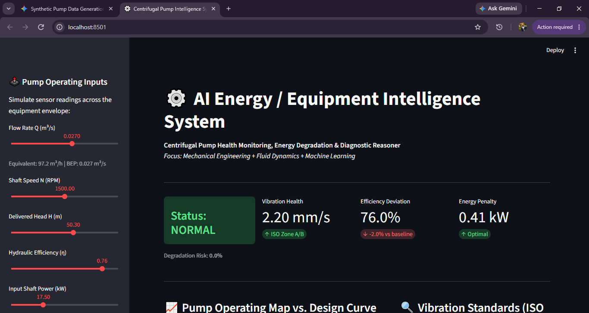

# AI Energy / Equipment Intelligence System: Centrifugal Pump Health & Efficiency Diagnostics

An applied Mechanical Engineering and Machine Learning portfolio project demonstrating physics-informed equipment condition monitoring, energy degradation tracking, and diagnostic root-cause reasoning for centrifugal pumps.

---

---

## 📌 Executive Summary

Centrifugal pumps are critical rotating assets across oil and gas processing facilities, petrochemical refineries, and power generation plants. Undetected degradation leads to catastrophic failures (bearing seizure, seal blowouts) or substantial energy waste from internal recirculation.

This project bridges turbomachinery fluid mechanics and applied machine learning. Rather than treating machine learning as a pure black box, the system couples a classification model with theoretical pump affinity laws, hydraulic power equations, and ISO vibration severity standards to provide interpretable, actionable condition intelligence.

> Project Principle: This repository utilizes a physics-informed synthetic dataset grounded in empirical fluid dynamics equations and realistic fault modes (wear-ring clearance loss, mechanical unbalance, combined deterioration). It is designed as an engineering demonstration project, not a certified industrial safety system.

---

## ⚙️ Engineering & Fluid Mechanics Foundation

The diagnostic engine is built on fundamental turbomachinery and fluid dynamics principles:

### 1. Head & Hydrostatic Pressure Relationship
From the steady-flow Bernoulli equation applied between pump flanges:
H = Delta_P / (rho * g)

Where:
- H: Total dynamic head delivered (m)
- Delta_P: Differential pressure across discharge and suction (P_discharge - P_suction in Pa)
- rho: Fluid density (1000 kg/m3 clean water reference)
- g: Gravitational acceleration (9.81 m/s2)

### 2. Pump Characteristic Curve (H-Q)
Modeled using an illustrative quadratic drooping characteristic for backward-curved impellers:
H = H0 - k * Q^2

Scaled for speed fluctuations via the affinity law:
H(Q, N) = (H0 - k * Q^2) * (N / N_ref)^2

Where H0 = 62.0 m, k = 16000, and N_ref = 1500 RPM.

### 3. Thermodynamic & Hydraulic Power Balance
Hydraulic power transferred to the fluid:
Ph = (rho * g * Q * H) / 1000  (kW)

Shaft input power required from the electric motor:
P_input = Ph / eta  (kW)

When internal wear or recirculation occurs, hydraulic efficiency (eta) decreases, forcing the motor to draw higher P_input for the same flow output.

### 4. Vibration Severity (ISO 10816-3)
Mechanical health is mapped against overall RMS vibration velocity thresholds:
- Zone A/B (< 2.8 mm/s): Good / Unrestricted continuous operation.
- Zone C (2.8 to 4.5 mm/s): Unsatisfactory; restricted operation, trending required.
- Zone D (> 4.5 mm/s): Critical / Unacceptable; immediate trip or inspection required.

---

## 🏗️ System Architecture

AI_Energy_Equipment_Intelligence/
├── engineering/
│   ├── pump_engineering.py     # Fluid mechanics equations & baseline curves
│   └── pump_intelligence.py    # Diagnostic reasoner & ISO 10816 evaluator
├── data/
│   ├── generate_pump_data.py   # Physics-informed synthetic dataset generator
│   ├── explore_pump_data.py    # Exploratory Data Analysis & visualizer
│   └── pump_dataset.csv        # 1,000 operational records (Normal vs. Abnormal)
├── models/
│   ├── train_pump_classifier.py  # Model training, evaluation & artifact export
│   └── pump_condition_model.joblib # Serialized inference pipeline
├── app/
│   └── streamlit_app.py        # Interactive monitoring dashboard
├── images/
│   └── dashboard_preview.png   # Dashboard UI preview screenshot
├── requirements.txt            # Project dependencies
└── README.md                   # Technical documentation

---

## 🔬 Machine Learning Methodology & Engineering Insights

### Dataset Generation
- 1,000 Operational Records across an operating envelope of 0.010 to 0.040 m3/s (approx. 36 to 144 m3/h).
- Class Split: ~73% Normal, ~27% Abnormal (simulating realistic industrial maintenance distributions).
- Multi-Fault Injection: Injected independent fault modes:
  1. Hydraulic Wear Mode: Efficiency drop (8-18%), delivered head loss, normal-to-mild vibration.
  2. Mechanical Unbalance Mode: Elevated vibration (> 4.5 mm/s), normal hydraulic efficiency.
  3. Combined Deterioration: Simultaneous thermodynamic loss and vibration spikes.

### Model Evaluation & Diagnostic Findings
- Logistic Regression: Achieved ~98% accuracy and 92% recall on test data, effectively balancing continuous linear weights across vibration and power draw.
- Decision Tree (max_depth=4): Achieved ~93% accuracy with 75% recall.
- Key Engineering Insight: The Decision Tree revealed the risk of false negatives in rotating equipment monitoring. Because shallow trees rely on hard threshold cuts, subtle hydraulic wear with normal vibration can evade a tree classifier. This underscores why industrial monitoring systems must pair ML classification with physics-based deviation thresholds (Delta_eta, Delta_H, excess kW).

---

## 💻 Installation & Quickstart

### 1. Clone the Repository & Set Up Virtual Environment
git clone https://github.com/your-username/AI_Energy_Equipment_Intelligence.git
cd AI_Energy_Equipment_Intelligence

# Create virtual environment
python -m venv venv

# Activate virtual environment
# Windows (PowerShell):
.\venv\Scripts\Activate.ps1
# Mac/Linux:
source venv/bin/activate

### 2. Install Dependencies
pip install -r requirements.txt

### 3. Generate Data & Train Model
# Generate synthetic dataset
python data/generate_pump_data.py

# Run Exploratory Data Analysis
python data/explore_pump_data.py

# Train and evaluate ML models
python models/train_pump_classifier.py

### 4. Launch Interactive Intelligence Dashboard
streamlit run app/streamlit_app.py

---

## 📊 Dashboard Features
- Real-Time Condition Inference: Live classification (Normal vs. Abnormal) with degradation probability.
- Dynamic Operating Map: Live point overlay on the baseline H-Q curve with Best Efficiency Point (BEP) indicator.
- ISO 10816-3 Gauge: Live vibration health classification.
- Energy Penalty Assessment: Instant calculation of wasted kW and annualized electrical operating cost ($/year).
- Diagnostic Reasoner: Generates root-cause physical indicators and recommended maintenance interventions.

---

## 🔮 Future Enhancements
1. Dynamic Degradation Time-Series: Simulate multi-month sensor drift to enable Remaining Useful Life (RUL) estimation using LSTMs or Survival Analysis.
2. Cavitation Detection (NPSHa vs. NPSHr): Incorporate suction pressure and fluid vapor pressure to detect cavitation onset.
3. Multi-Class Fault Diagnosis: Expand target labels into distinct fault categories (Bearing Degradation, Impeller Erosion, Cavitation, Misalignment).