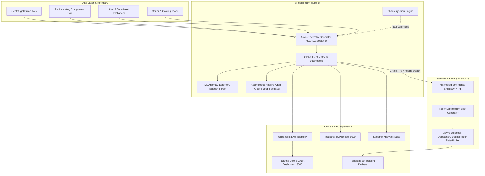

```markdown
# AI Energy & Equipment Intelligence Suite
### Autonomous Industrial SCADA, Digital Twin Analytics & Closed-Loop Chaos Incident Dispatch

[](https://www.python.org/)
[](https://fastapi.tiangolo.com/)
[]()
[]()
[]()

---

## 📌 Executive Overview

The **AI Energy & Equipment Intelligence Suite** is an edge-to-cloud industrial SCADA platform designed for predictive health diagnostics, dynamic fault injection, and automated emergency trip response across heavy process plant equipment.

It couples **first-principles thermodynamic/hydraulic models** with an **autonomous healing agent**, an **isolation anomaly detection engine**, and an **automated incident dispatcher**. When critical excursions occur—whether naturally or via simulated chaos engineering—the system executes an Emergency Shutdown (ESD), produces an immutable PDF incident brief, and dispatches it straight to plant reliability engineers via Telegram webhooks in sub-2 seconds.

---

## 🏗️ System Architecture



---

## 🚀 Key Functional Modules

### 1. 4-Asset Thermodynamic & Hydraulic Digital Twins

* **Centrifugal Pump**: Flow vs. Head affinity calculations, motor hydraulic efficiency curves, RMS vibration monitoring, and bearing temperature thermal expansion.
* **Gas Compressor**: Polytropic compression exponent estimation, discharge temperature differentials, pressure ratios, and aerodynamic stall detection.
* **Shell & Tube Heat Exchanger**: Logarithmic Mean Temperature Difference (LMTD), overall heat transfer coefficient (U-value), and fouling thermal resistance tracking.
* **Chiller & Induced-Draft Cooling Tower**: kW/ton specific energy consumption, approach temperature, and condenser water circulation loop analytics.

### 2. Chaos Engineering & Fault Simulation Framework

Built-in RESTful injection vectors allow operators to challenge the plant's interlocks:

* `BEARING_SEIZURE`: Forces mechanical friction excursion (48.6 mm/s vibration, 142.0 C bearing temperature).
* `COMPRESSOR_SURGE`: Simulates severe discharge pressure spikes (9.8 bar) with catastrophic CFM drop.
* `TUBE_RUPTURE`: Induces thermal bypass excursion and rapid delta-T collapse.

### 3. Automated Closed-Loop ESD & Incident Briefing

* **Dynamic PDF Generation**: Compiles final telemetry snapshot, anomaly scores, and root-cause indicators into an incident report using ReportLab.
* **Real-Time Remote Dispatch**: Bypasses traditional delayed email channels to push the generated PDF and interlock metadata directly to field reliability engineers over Telegram.
* **Alert Deduplication & Throttling**: Implements cooldown state-locking to eliminate Telegram alert flooding while maintaining critical trip awareness.

### 4. Protocol Support & SCADA Visualization

* **Native Industrial TCP Bridge**: Exposes telemetry state on port 5020 mimicking PLC holding registers.
* **WebSocket Streaming UI**: High-refresh browser console (http://127.0.0.1:8000) built with responsive Tailwind CSS.
* **Streamlit Analytics Hub**: Historical telemetry time-series exploration and RUL forecasting.

---

## 🛠️ Technology Stack

| Layer | Technologies |
| --- | --- |
| **Core Engine** | Python 3.11+, AsyncIO, NumPy, Scikit-learn (Isolation Forest) |
| **API & Sockets** | FastAPI, Uvicorn, WebSockets, RESTful JSON API |
| **Industrial Bridge** | Async Socket Server (Modbus/TCP holding register emulator) |
| **Reporting & Dispatch** | ReportLab (PDF compilation), Telegram Bot API, Requests |
| **Frontend & UI** | HTML5, Tailwind CSS, WebSocket Client, Streamlit |
| **Persistence** | SQLite3 Local Historical Snapshot Repository |

---

## ⚡ Quickstart & Local Setup

### 1. Prerequisites

Ensure Python 3.11 or higher is installed:

```powershell
python --version

```

### 2. Clone and Install Dependencies

```powershell
git clone [https://github.com/Bamstep/AI_Energy_Equipment_Intelligence.git](https://github.com/Bamstep/AI_Energy_Equipment_Intelligence.git)
cd AI_Energy_Equipment_Intelligence
pip install -r requirements.txt

```

### 3. Launch the Central SCADA Platform

```powershell
python ai_equipment_suite.py

```

* **Web SCADA Dashboard**: Open `http://127.0.0.1:8000` in your browser.
* **Industrial TCP Bridge**: Active on `127.0.0.1:5020`.

### 4. Launch the Streamlit Analytics Interface (Optional)

```powershell
streamlit run app/streamlit_app.py

```

---

## 🧪 Testing Chaos Scenarios

You can trigger catastrophic faults either directly from the Web Dashboard (http://127.0.0.1:8000) or programmatically via PowerShell:

```powershell
# 1. Inject Bearing Seizure
Invoke-RestMethod -Uri "[http://127.0.0.1:8000/api/chaos/inject](http://127.0.0.1:8000/api/chaos/inject)" -Method Post -ContentType "application/json" -Body '{"fault_type": "BEARING_SEIZURE"}'

# 2. Check Active Fault Status
Invoke-RestMethod -Uri "[http://127.0.0.1:8000/api/chaos/status](http://127.0.0.1:8000/api/chaos/status)"

# 3. Reset and Normalize Equipment
Invoke-RestMethod -Uri "[http://127.0.0.1:8000/api/chaos/reset](http://127.0.0.1:8000/api/chaos/reset)" -Method Post

```

---

## 📂 Project Structure

```text
AI_Energy_Equipment_Intelligence/
├── app/
│   └── streamlit_app.py         # Streamlit analytical dashboard & trend viewer
├── ai_equipment_suite.py        # Central runtime: Digital Twins, SCADA, FastAPI & Dispatcher
├── equipment_telemetry.db       # Historical sensor snapshot database
├── incident_report.pdf          # Latest generated PDF diagnostic brief
├── requirements.txt             # Python dependencies
└── README.md                    # Project documentation

```

---

## 📜 License

Distributed under the MIT License.

```

```
